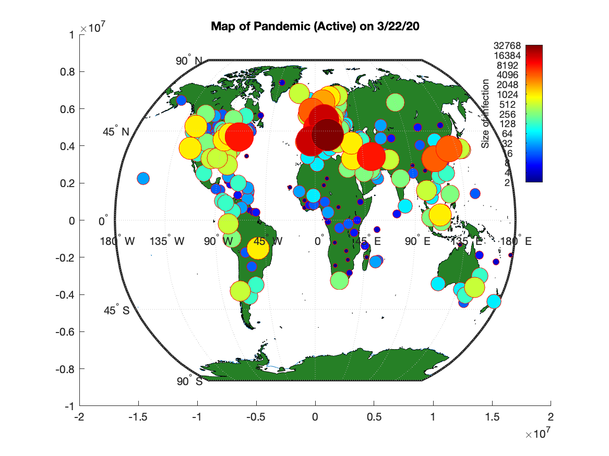
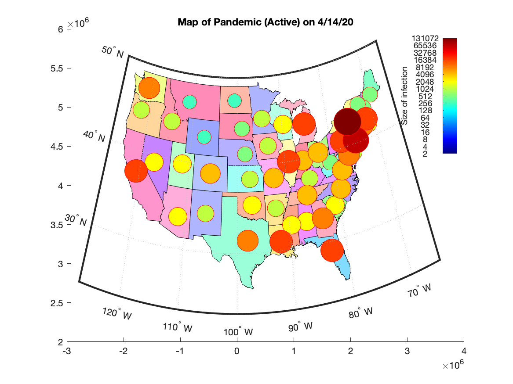
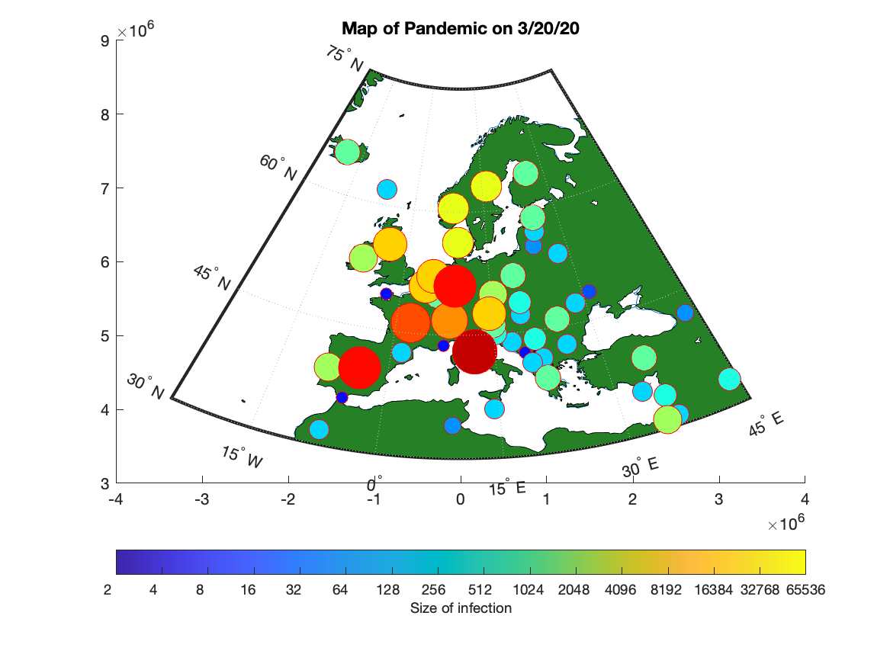

# Matlab_Wrap_for_JHU_COVID19

This repository contains a very simple Matlab wrapper for Johns Hopkins University's COVID-19 data set.

Functions:
1) Loads recent JHU spatial and temporal pandemic the data into Matlab.
2) Allows the user to plot the infections and deaths versus time for countries and states.
3) Compute and plot a simple exponential growth trend lines based on the past 'N' days.
4) Computes doubling time and for all countries and states to compare in table.
5) Create map (World, US, or Europe) of pandemic hot spots at any day for the last 3 months.  
6) Create and export a movie of pandemic hotspots versus time.
7) Fit a simple Susceptible, Infected, Severe, Recovered, Death model to data for different countries or states.

To use the wrapper, you first need to clone the JHU repository at: https://github.com/CSSEGISandData/COVID-19

To run from the Matlab command window, just navigate to the correct folder and type: "COVID19_Matlab_App". If you place both this and the JHU repositories in a common folder, it should run directly.  Otherwise, you will be prompted to find the appropriate data.  These are found in the folder "COVID-19/COVID-19/csse_covid_19_data/csse_covid_19_time_series/".

Please let me know if you would like to see any added functionality. 

  
